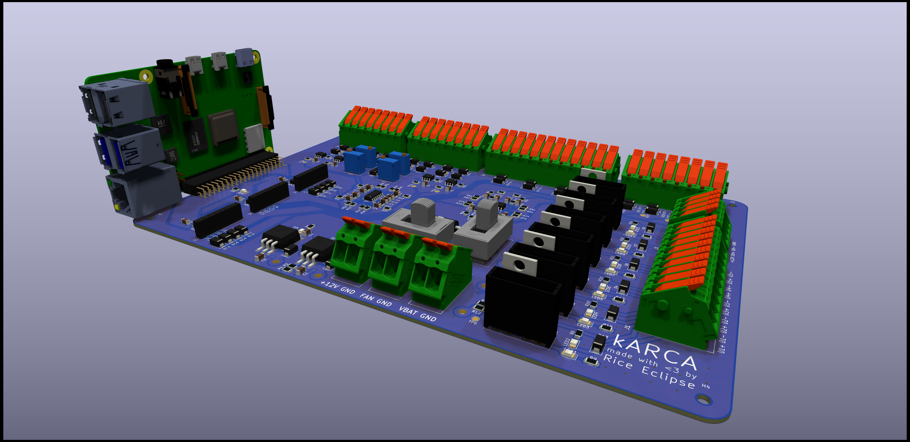

# kARCA Design Outline

This design outline is inteded as a reference for future Rice Eclipse members who either need to
edit the design of kARCA or better understand it.

It is also intended to be a comprehensive spec for working with the board.

## Project Motivation

Rice Eclipse is a student-run organization which designs, builds, and tests its own rocket motors.
To furnish this process, we build our own engine controller electronics systems from scratch.
`kARCA` is the latest revision of Eclipse's controller hardware: it communicates with a user-facing
dashboard to allow the user to control the engine in real time.

`kARCA` is part of a larger hardware and software stack which is essential to Eclipse's engine
testing system.
The user-facing dashboard, [`slonkboard`](https://github.com/rice-eclipse/slonkboard) is a
front-end application which allows mission control to easily use the controller.
Inside of the `kARCA` controller, a Raspberry Pi runs the controller software, `slonk`, which
receives messages from `slonkboard` and executes them, while also logging data and transmitting it
to `slonkboard`.

`kARCA` is intended as a replacement to an older control board, called the "Mk1.1 engine
controller."
The main reason for this replacement is because it's showing its age: the Mk1.1 controller was
designed for smaller valves and with fewer capabilities than its replacement.
In addition, a fire caused irreparable damage to one of the pressure transducer amplifiers on the
controller hardware.

## Requirements

kARCA has a few client needs that it must support for Rice Eclipse's Titan and Proxima rocket
motors.
It must:

1. Collect data from 4 load cells.
1. Collect data from 4 pressure transducers.
1. Collect data from 4 thermocouples.
1. Control the ignition system, driving up to 50 amps at 12 volts to the igniters.
1. Control 5 valves, each consuming up to 1 amp at 12 volts, by user command.
1. Transmit real-time data on load cells, pressure transducers, thermocouples, and valve actuation
   states to the user.

## Design

### Power regulation

Power management consists of 3 separate voltage levels: 12 volts, 10 volts, and 5 volts.

The 12 volt lines are used for powering the solenoid driver circuits, the router, and the fan.
The 10 volt line is used for powering the analog amplification hardware (with the exception of the
load cell instrumentation amplifiers) and the pressure transducers.
The 5 volt line is used for powering the Raspberry Pi, the ADCs, the instrumentation amplifiers,
the thermocouple breakout boards, and the load cell.

The 5 volt and 10 volt lines are both supplied by linear dropout (LDO) regulators.
These regulators have the benefit of being stupid-simple at the cost of poor efficiency.
We've included flyback Schottky diodes on each regulator to hopefully reduce the risk of
reverse-biasing damanging the regulators.

_Note for future designs: it is possible to remove the 10V line from the design and substitute the
12V line.
The 10V line was only kept for backward compatibility, not for any material value._

The status light LED13 is lit when power is supplied to the 12V battery line.
LED14 and LED15 are lit when the LDO regulators for 10V and 5V respectively are working.

### Data collection

#### Load cells

A load cell is a linear device used to measure force.
Power is supplied to the load cell through a positive and negative terminal, and then the load cell
returns a differential output.
The differential voltage $V_{\mathit{dm}}$ grows linearly with the force on the load cell.
If the voltage given to the load cell is $V_{\mathit{DD}}$, the output voltage $V_{\mathit{dm}}$ is
linearly proportional to the input voltage and the load $F$ via the constants $r$ and $FS$.

$$
V_{\mathit{dm}} = \frac{r}{\mathit{FS}} V_{\mathit{DD}} F
$$

$\mathit{FS}$ is the full-scale force of the load cell, and $r$ is the mV/V rating of the load cell.
Typically, $r$ is very small, so a high amount of amplification is needed to get an ADC-readable
signal.
Additionally, since $V_{\mathit{dm}}$ is a differential-mode signal, we must use an instrumentation
amplifier to convert the differential voltage to an absolute voltage.

On `kARCA`, there are two amplification stages for each load cell channel.
The first stage is an instrumentation amplifier, which amplifies the voltage measured and also
shifts the signal to a differential-mode value.
The second stage is an anti-aliasing filter, which low-passes the analog signal from the
instrumentation amplifier and also amplifies it further.

The total gain in the load cell amplifier is the product of the gains of the two stages.
The instrumentation amplifier has a gain of
$1 + \frac{20 \text{k} \Omega}{200 \Omega} = 101$, while the anti-aliasing filter has a
gain of $1 + \frac{15 \text{k} \Omega}{10 \text{k} \Omega} = 2.5$, yielding a final gain of 252.5.

The
[load cell for the Titan rocket motor](https://prod-edam.honeywell.com/content/dam/honeywell-edam/sps/siot/en-us/products/test-and-measurement-products/load-cells/low-profile/model-41-series/documents/sps-siot-t-m-model-41-precision-load-cell-product-sheet-008609-3-en-ciid-149301.pdf?download=false)
has a scale of 3mV/V and a full-scale force of 3000, yielding an output voltage equal to the load
$F$ times $1.2625 \frac{\text{mV}}{\text{lb f}}$.
This corresponds to a full-scale range of 3960 lb f.

At extremely high loads, the load cell amplifier could ouput voltages greater than 5 V to the ADC.
This would likely damage the ADC, so we included Schottky diodes to clamp the voltage below 5.5 V.

#### Pressure transducers

Our pressure transducers are 4-20 mA devices.
This means that when supplied with a voltage greater than 8 V, the pressure transducers will pull
a current as an affine transform of the pressure (4 mA for 0 psi g, and 20 mA for 1000 psi g).

To convert the current to a voltage, we place the pressure transducer in series with a 22 $\Omega$
resistor, yielding an input voltage between 0.088 and 0.44 V.
Since the supply voltage is 10 V, the voltage given to the pressure transducer will never be below
9.66 V, which leaves plenty of headroom past the minimum 8 V requirement.

We then amplify the input voltage by a gain of 10.22, yielding a minimum output voltage of 0.898 V
and a maximum of 4.5 V.
Although we aren't using the full scale, it's "good enough" for our needs, giving us a resolution of
0.34 psi.
The gain of the amplifier is determined by the ratio of the feeback and gain resistors on the output
of the amplifier.
The gain for each channel is the same, so we only provide a sample formula for PT1's gain below.

$$
G = 1 + \frac{R_{73}}{R_{75}}
$$

Additionally, we anti-alias the pressure transducer signal with a two-pole Sallen-Key low-pass
filter.
The cutoff frequency is identical across all four PT channels, and is determined by the values of the input resistors and capacitors in the amplifier.
We provide a sample formula for PT1's gain below.

$$
f_c = \frac{1}{2 \pi \sqrt{R_{68} R_{69} C_{28} C_{26}}}
$$

Since the pressure transducer anti-aliasing amplifier is supplied by 10 V, we also include a set of
Schottky diodes to prevent the amplifier from sending too high of a voltage to the ADC.

#### Thermocouples

We use an [Adafruit AD8495](https://www.adafruit.com/product/1778) (part number 1778) amplifier
breakout board, which gives a voltage between 0 and 5V as an affine function of the measured
thermocouple temperature.
As a result, no amplification is needed and we can simply run the result directly to the ADC.
This makes the thermocouple data acquisition the easiest part of the design.
On the board end, only 3 connections are needed: positive voltage source, ground, and an analog
input.

However, the breakout board used only supports K-type thermocouples.
If, in the future, we decide to use other thermocouples, we may need to consider other avenues of
approach.

### Valve actuation

### Ignition system

As far as the `kARCA` PCB is concerned, the ignition system is just another valve.
Externally, though, the ignition system is a two-step sequence of relays.

## Pinouts

This is intended as a reference for programmers working on `slonk`,

### Raspberry Pi

| Number | Raspberry Pi function | GPIO ID | Board function   |
| -----: | --------------------- | ------: | ---------------- |
|      1 | +3.3V                 |       - | -                |
|      2 | +5V                   |       - | +5V              |
|      3 | GPIO                  |       2 | -                |
|      4 | +5V                   |       - | +5V              |
|      5 | GPIO                  |       3 | -                |
|      6 | GND                   |       - | GND              |
|      7 | GPIO                  |       4 | -                |
|      8 | UART0 TX              |      14 | -                |
|      9 | GND                   |       - | GND              |
|     10 | UART0 RX              |      15 | -                |
|     11 | GPIO                  |      17 | Driver 6 control |
|     12 | GPIO                  |      18 | -                |
|     13 | GPIO                  |      27 | Driver 5 control |
|     14 | GND                   |       - | GND              |
|     15 | GPIO                  |      23 | Driver 4 control |
|     16 | GPIO                  |      23 | -                |
|     17 | +3.3V                 |       - | -                |
|     18 | GPIO                  |      24 | -                |
|     19 | SPI0 MOSI             |      10 | SPI MOSI         |
|     20 | GND                   |       - | GND              |
|     21 | SPI0 MISO             |       9 | SPI MISO         |
|     22 | GPIO                  |      25 | ADC1 CS          |
|     23 | SPI0 SCLK             |      11 | SPI CLK          |
|     24 | SPI0 CS0              |       8 | ADC2 CS          |
|     25 | GND                   |       - | GND              |
|     26 | SPI0 CS1              |       7 | ADC3 CS          |
|     27 | I2C EEPROM data       |       - | -                |
|     28 | I2D EEPROM clock      |       - | -                |
|     29 | GPIO                  |       5 | Heartbeat        |
|     30 | GND                   |       - | GND              |
|     31 | GPIO                  |       6 | Driver 3 control |
|     32 | GPIO                  |      12 | -                |
|     33 | GPIO                  |      13 | Driver 2 control |
|     34 | GND                   |       - | GND              |
|     35 | GPIO                  |      19 | Driver 1 control |
|     36 | GPIO                  |      16 | -                |
|     37 | GPIO                  |      26 | -                |
|     38 | GPIO                  |      20 | -                |
|     39 | GND                   |       - | GND              |
|     40 | GPIO                  |      21 | -                |

### ADC1 - Load cells

| Channel | Use    |
| ------- | ------ |
| 0       | LC1    |
| 1       | LC2    |
| 2       | LC3    |
| 3       | LC4    |
| 4       | unused |
| 5       | unused |
| 6       | unused |
| 7       | unused |

### ADC2 - Pressure transducers

| Channel | Use    |
| ------- | ------ |
| 0       | PT1    |
| 1       | PT2    |
| 2       | PT3    |
| 3       | PT4    |
| 4       | unused |
| 5       | unused |
| 6       | unused |
| 7       | unused |

### ADC3 - Thermocouples

| Channel | Use    |
| ------- | ------ |
| 0       | TC1    |
| 1       | TC2    |
| 2       | TC3    |
| 3       | TC4    |
| 4       | unused |
| 5       | unused |
| 6       | unused |
| 7       | unused |

## Wiring

This is a reference table for the internal wiring of the box and the external wiring harness of the
Titan rocket system.

**WARNING: This wiring harness was actually made with an oversight. In an XLR connector, pin 1
should nominally always be ground because it is connected to the chassis and outside housing of the
connector.
The original designers of the wiring harness that `kARCA` replaces did not account for this.
As a result, that legacy pin assignment was in error.
The `kARCA` pin assignment matches that legacy assignment because it was assumed that the legacy
system would be needed as a backup.
We strongly recommend re-soldering every connector in the system as soon as the predecessor system
can be retired.**

In each of the tables below, _Color (External)_ refers to the color of the wire in the exterior
wiring harness, which may not match the internal color.

### Pressure transducer wiring

| XLR Pin Number | Purpose    | Color (Internal) | Color (External) | Gauge (AWG) |
| -------------- | ---------- | ---------------- | ---------------: | ----------- |
| 1              | +10V       | Red              |              Red | 22          |
| 2              | Signal (-) | Blue             |             Blue | 22          |
| 3              | Unused     | -                |                - | 22          |

### Load cell wiring

The load cells use a wonky 5-pin XLR connector.

Traditionally, green is used for ground or negative signals, but this is yet another design error
inherited from legacy systems.

| XLR Pin Number | Purpose    | Color (Internal) | Color (External) | Gauge (AWG) |
| -------------- | ---------- | ---------------- | ---------------- | ----------: |
| 1              | Signal (-) | White            | White            |          22 |
| 2              | +5V        | Red              | Red              |          22 |
| 3              | Ground     | Black            | Black            |          22 |
| 4              | Signal (+) | Green            | Green            |          22 |
| 5              | Unused     | -                | -                |           - |

### Thermocouple wiring

| XLR Pin Number | Purpose | Color (Internal) | Color (External) | Gauge (AWG) |
| -------------- | ------- | ---------------- | ---------------- | ----------- |
| 1              | +5V     | Red              | Red              | 22          |
| 2              | Ground  | Black            | Black            | 22          |
| 3              | Signal  | White            | ?                | 22          |

### Driver wiring

Note that this only applies to drivers 1 through 5; driver 6 is connected internally to the ignition
system.

| XLR Pin Number | Purpose     | Color (Internal) | Color (External) | Gauge (AWG) |
| -------------- | ----------- | ---------------- | ---------------- | ----------- |
| 1              | +12V        | Red              | Red              | 14          |
| 2              | Control (-) | Black            | Black            | 14          |
| 3              | Unused      | -                | -                | -           |

### Battery power wiring

### Ignition wiring
