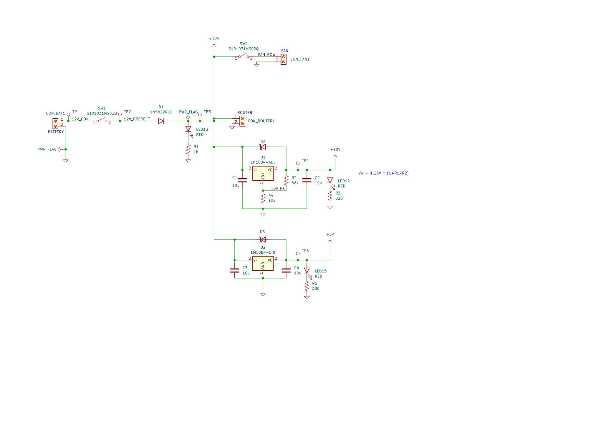
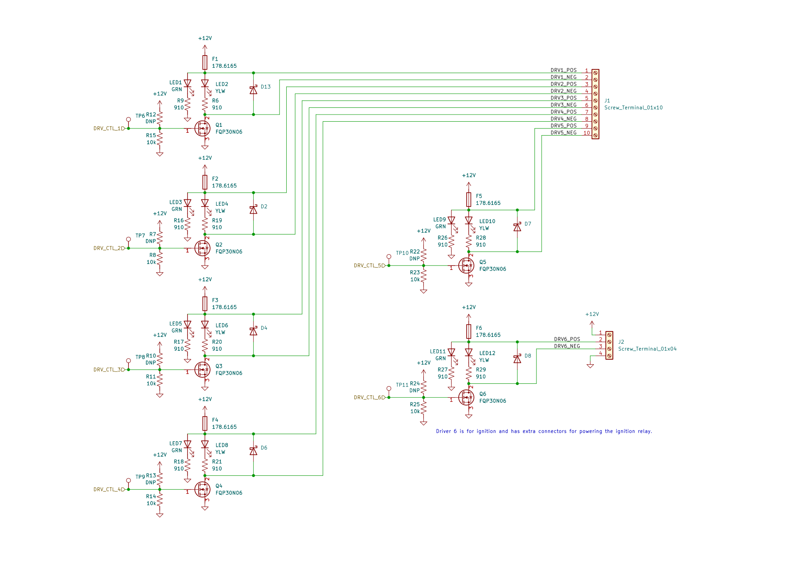

# kARCA Design Outline

This design outline is inteded as a reference for future Rice Eclipse members who either need to
edit the design of kARCA or better understand it.

It is also intended to be a comprehensive spec for working with the board.

## Project Motivation

Rice Eclipse is a student-run organization which designs, builds, and tests its own rocket motors.
To furnish this process, we build our own engine controller electronics systems from scratch.
`kARCA` is the latest revision of Eclipse's controller hardware: it communicates with a user-facing
dashboard to allow the user to control the engine in real time.

`kARCA` is part of a larger hardware and software stack which is essential to Eclipse's engine
testing system.
The user-facing dashboard, [`slonkboard`](https://github.com/rice-eclipse/slonkboard) is a
front-end application which allows mission control to easily use the controller.
Inside of the `kARCA` controller, a Raspberry Pi runs the controller software, `slonk`, which
receives messages from `slonkboard` and executes them, while also logging data and transmitting it
to `slonkboard`.

`kARCA` is intended as a replacement to an older control board, called the "Mk1.1 engine
controller."
The main reason for this replacement is because it's showing its age: the Mk1.1 controller was
designed for smaller valves and with fewer capabilities than its replacement.
In addition, a fire caused irreparable damage to one of the pressure transducer amplifiers on the
controller hardware.

## Requirements

kARCA has a few client needs that it must support for Rice Eclipse's Titan and Proxima rocket
motors.
It must:

1. Collect data from 4 load cells.
1. Collect data from 4 pressure transducers.
1. Collect data from 4 thermocouples.
1. Control the ignition system, driving up to 50 amps at 12 volts to the igniters.
1. Control 5 valves, each consuming up to 1 amp at 12 volts, by user command.
1. Transmit real-time data on load cells, pressure transducers, thermocouples, and valve actuation
   states to the user.

## Design

### Power regulation

### Data collection

#### Load cells

### Valve actuation

### Ignition system

As far as the `kARCA` PCB is concerned, the ignition system is just another valve.
Externally, though, the ignition system is a two-step sequence of relays.

## Pinouts

This is intended as a reference for programmers working on `slonk`,

### Raspberry Pi

| Number | Raspberry Pi function | GPIO ID | Board function   |
| -----: | --------------------- | ------: | ---------------- |
|      1 | +3.3V                 |       - | -                |
|      2 | +5V                   |       - | +5V              |
|      3 | GPIO                  |       2 | -                |
|      4 | +5V                   |       - | +5V              |
|      5 | GPIO                  |       3 | -                |
|      6 | GND                   |       - | GND              |
|      7 | GPIO                  |       4 | -                |
|      8 | UART0 TX              |      14 | -                |
|      9 | GND                   |       - | GND              |
|     10 | UART0 RX              |      15 | -                |
|     11 | GPIO                  |      17 | Driver 6 control |
|     12 | GPIO                  |      18 | -                |
|     13 | GPIO                  |      27 | Driver 5 control |
|     14 | GND                   |       - | GND              |
|     15 | GPIO                  |      23 | Driver 4 control |
|     16 | GPIO                  |      23 | -                |
|     17 | +3.3V                 |       - | -                |
|     18 | GPIO                  |      24 | -                |
|     19 | SPI0 MOSI             |      10 | SPI MOSI         |
|     20 | GND                   |       - | GND              |
|     21 | SPI0 MISO             |       9 | SPI MISO         |
|     22 | GPIO                  |      25 | ADC1 CS          |
|     23 | SPI0 SCLK             |      11 | SPI CLK          |
|     24 | SPI0 CS0              |       8 | ADC2 CS          |
|     25 | GND                   |       - | GND              |
|     26 | SPI0 CS1              |       7 | ADC3 CS          |
|     27 | I2C EEPROM data       |       - | -                |
|     28 | I2D EEPROM clock      |       - | -                |
|     29 | GPIO                  |       5 | Heartbeat        |
|     30 | GND                   |       - | GND              |
|     31 | GPIO                  |       6 | Driver 3 control |
|     32 | GPIO                  |      12 | -                |
|     33 | GPIO                  |      13 | Driver 2 control |
|     34 | GND                   |       - | GND              |
|     35 | GPIO                  |      19 | Driver 1 control |
|     36 | GPIO                  |      16 | -                |
|     37 | GPIO                  |      26 | -                |
|     38 | GPIO                  |      20 | -                |
|     39 | GND                   |       - | GND              |
|     40 | GPIO                  |      21 | -                |

### ADC1 - Load cells

| Channel | Use    |
| ------- | ------ |
| 0       | LC1    |
| 1       | LC2    |
| 2       | LC3    |
| 3       | LC4    |
| 4       | unused |
| 5       | unused |
| 6       | unused |
| 7       | unused |

### ADC2 - Pressure transducers

| Channel | Use    |
| ------- | ------ |
| 0       | PT1    |
| 1       | PT2    |
| 2       | PT3    |
| 3       | PT4    |
| 4       | unused |
| 5       | unused |
| 6       | unused |
| 7       | unused |

### ADC3 - Thermocouples

| Channel | Use    |
| ------- | ------ |
| 0       | TC1    |
| 1       | TC2    |
| 2       | TC3    |
| 3       | TC4    |
| 4       | unused |
| 5       | unused |
| 6       | unused |
| 7       | unused |
